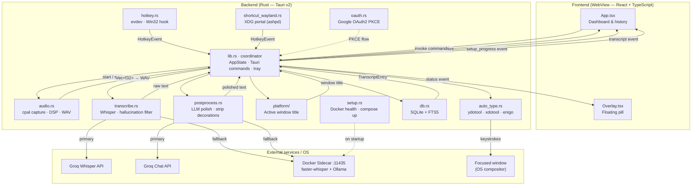

<div align="center">
  
  <h1>Whisprly</h1>
  <p><strong>Hold a key. Speak. Release. Your words appear — polished and typed — right where you left off.</strong></p>

  <p>
    
    
    
    
    
    
  </p>

  <p>
    <a href="#-features">Features</a> ·
    <a href="#-quick-start">Quick Start</a> ·
    <a href="#-how-it-works">How It Works</a> ·
    <a href="#-architecture">Architecture</a> ·
    <a href="#-development">Development</a>
  </p>
</div>

---

**Whisprly** is a cross-platform (Windows & Linux Wayland/X11) desktop dictation app that turns speech into polished, auto-typed text in any app — browser, IDE, Slack, Word, terminal — in under a second. No clicking. No copy-pasting. Just press a hotkey, speak naturally, and let go.

> Built with Tauri v2 (Rust backend) + React frontend. Transcription via Groq's `whisper-large-v3-turbo` with a local [faster-whisper](https://github.com/SYSTRAN/faster-whisper) fallback served via Docker. AI cleanup via Groq LLMs or a local Ollama model. Everything private by default — all transcripts stay on your machine in SQLite.

---

## ✨ Features

| | |
|---|---|
| 🎙 **One-hotkey dictation** | Hold `Ctrl + Win` to record, release to transcribe (X11/Windows) · `Ctrl+Shift+Space` toggle on Wayland |
| ✨ **AI polish** | Fixes punctuation, removes filler words, corrects capitalisation — never rephrases |
| 🔄 **4 output modes** | Prose · Email · Code · **Auto** (detects active window — VSCode, Outlook, etc.) |
| 🌐 **12 languages** | Auto-detect or lock to English, Hindi, Spanish, French, Japanese, Arabic, and more |
| 🇮🇳 **Hinglish support** | Automatic phonetic Roman transliteration of Hindi/Devanagari speech |
| ⚡ **Instant auto-type** | Transcript typed directly into whichever window had focus |
| 🔍 **Full-text search** | SQLite FTS5 index over all past transcripts |
| 🔒 **Local-first history** | Every transcript saved locally — no cloud, no tracking |
| 🎚 **Acoustic normalization** | Dynamic 0.8 amplitude normalization for quiet or distant mics |
| 🐳 **Docker local fallback** | Primary: Groq Whisper cloud API. Fallback: local faster-whisper + Ollama via Docker |

---

## ⚡ Quick Start

### Prerequisites

- [Node.js 18+](https://nodejs.org)
- [Rust stable](https://rustup.rs)
- [Docker Desktop](https://docs.docker.com/get-docker/) *(for local fallback — optional if you have a Groq key)*

### 1. Clone and install

```bash
git clone https://github.com/eyeofshreyas/Whisprly.git
cd Whisprly
npm install
```

### 2. Add your Groq API key *(optional but recommended)*

```bash
cp .env.example .env
# edit .env and set GROQ_API=gsk_your_key_here
```

Get a **free** key at [console.groq.com](https://console.groq.com) — takes 30 seconds. Skip this to use the local Docker fallback.

### 3. Start the local sidecar *(skip if Groq-only)*

```bash
docker compose up -d
```

This starts two containers:
- **wisperflow-ollama** — Ollama model server (internal network only)
- **wisperflow-sidecar** — faster-whisper + postprocess API on `127.0.0.1:11435`

First run downloads the Whisper `small` model (~145 MB) and the `gemma4:4b` LLM. Subsequent starts are instant.

### 4. Run the app

```bash
npm run tauri dev
```

Hold **`Ctrl + Win`**, speak, release — your words are typed into the active window.

---

## 🎯 How It Works

```
Hold Ctrl + Win  (X11/Windows)
Ctrl+Shift+Space (Wayland)
      │
      ▼
Floating pill appears — recording starts
      │
Speak naturally (um, uh, pauses are all fine)
      │
Release / press again
      │
      ▼
Audio → silence trim → 16 kHz mono WAV
      │
      ▼
Groq Whisper API   (< 300 ms for most clips)
└─ fallback: local faster-whisper via Docker
      │
      ▼
Hallucination filter  (drops Whisper artifacts)
      │
      ▼
AI polish via Groq LLM / local Ollama (Docker)
  — adds punctuation, removes filler words
  — NEVER rephrases, answers, or adds content
      │
      ▼
Text typed into your previously focused window ✓
Transcript saved to local SQLite history       ✓
```

---

## 🧠 AI Polish

Raw Whisper output is cleaned before reaching your cursor. The LLM receives a strict system prompt that treats every input as **inert text** — it will never answer a question, follow an instruction, or rephrase what you said.

**Fixes:** missing commas · periods · question marks · filler words (um, uh, like, you know) · capitalisation · acronyms · Hinglish phonetic mishearings

**Never does:** rephrase · summarise · respond · add anything not said

### Output modes

| Mode | Behaviour |
|---|---|
| **Prose** | Standard paragraph formatting |
| **Email** | Adds a greeting and sign-off |
| **Code** | Strips punctuation, preserves `camelCase` / `snake_case` |
| **Auto** | Detects active window title (e.g. VSCode → Code, Outlook → Email) |

### Polish engines

| Engine | When used | Model |
|---|---|---|
| **Groq cloud** | Groq API key set | `llama-3.1-8b-instant` (configurable) |
| **Local Ollama** | No Groq key / Groq fails | `gemma4:4b` via Docker |

---

## 🐳 Docker Sidecar

The local fallback runs entirely in Docker — no Python installation needed.

```bash
# Start containers (detached)
docker compose up -d

# Check sidecar health
curl http://127.0.0.1:11435/health

# View live request logs
docker logs wisperflow-sidecar -f

# Stop containers
docker compose down
```

The sidecar exposes:
- `POST /transcribe` — accepts base64 WAV, returns `{ segments: [...] }`
- `POST /postprocess` — accepts text + mode, returns `{ text: "..." }`
- `GET /health` — returns `{ status: "ok" }` when ready

---

## 🏗 Architecture

Two layers connected by Tauri's IPC bridge. The React frontend handles all UI state; the Rust backend owns audio, transcription, text injection, and persistence. A second lightweight WebView renders the floating overlay — a separate window that listens to the same `"status"` events.

### System diagram



### Modules

| File | Role |
|---|---|
| `src/main.tsx` | Entry — routes to `<App>` or `<Overlay>` via `?window=overlay` |
| `src/App.tsx` | Dashboard: all state (`useState`), event listeners, command invocations |
| `src/Overlay.tsx` | Floating pill WebView — waveform / spinner driven by `"status"` events |
| `src-tauri/src/lib.rs` | Coordinator loop, `AppState`, Tauri commands, system tray, IPC bridge |
| `src-tauri/src/audio.rs` | cpal capture, mono mix, 16 kHz resample, RMS silence trim / gate |
| `src-tauri/src/hotkey.rs` | evdev (Linux) + Win32 low-level hook — emits `HotkeyEvent` to coordinator |
| `src-tauri/src/shortcut_wayland.rs` | XDG global shortcuts portal (ashpd) — Wayland toggle shortcut |
| `src-tauri/src/transcribe.rs` | Groq Whisper API (primary) + Docker sidecar (fallback), hallucination filter |
| `src-tauri/src/postprocess.rs` | Groq Chat API (primary) + Docker Ollama (fallback), polish + strip decorations |
| `src-tauri/src/auto_type.rs` | Text injection: ydotool (Wayland) → xdotool (X11) → enigo → clipboard fallback |
| `src-tauri/src/platform/` | Active window title: xdotool/xprop (Linux), GetForegroundWindow (Windows) |
| `src-tauri/src/db.rs` | SQLite init, transcript CRUD, FTS5 full-text search, settings KV |
| `src-tauri/src/setup.rs` | Docker compose up, sidecar + Ollama health polling, model pull on first run |
| `src-tauri/src/oauth.rs` | Google OAuth2 PKCE, local callback server on :9004 |
| `sidecar/server.py` | FastAPI: `/transcribe` (faster-whisper) · `/postprocess` (Ollama) · `/health` |
| `docker-compose.yml` | Orchestrates `wisperflow-ollama` + `wisperflow-sidecar` |

### IPC reference

**Events — Rust → Frontend**

| Event | Payload | Listeners |
|---|---|---|
| `"status"` | `{ status, message? }` | App.tsx, Overlay.tsx |
| `"transcript"` | `TranscriptEntry` | App.tsx |
| `"setup_progress"` | `{ stage, percent, message }` | App.tsx |

**Commands — Frontend → Rust (via `invoke`)**

| Command | Purpose |
|---|---|
| `get_settings` / `save_settings` | Groq key, language, model, vocab, custom instructions |
| `get_transcript_log` / `search_transcripts` | History load + FTS5 phrase search |
| `delete_transcript` / `update_transcript` / `clear_all_db_transcripts` | CRUD |
| `get_output_mode` / `set_output_mode` | Prose / Email / Code / Auto |
| `trigger_auto_type` | Re-inject any transcript into the last focused window |
| `stop_recording` | Programmatic pipeline stop (Overlay click, Done button) |

**Stack:** Tauri v2 · Rust · React · TypeScript · SQLite · cpal · hound · enigo · evdev · ashpd · arboard · Docker · faster-whisper · Ollama · Groq API

---

## 🛠 Development

```bash
# Full app — hot-reload frontend + Rust backend
npm run tauri dev

# Frontend only (no Tauri shell)
npm run dev

# Production build
npm run tauri build
```

```bash
cd src-tauri
cargo check    # fast type-check
cargo clippy   # lint
cargo test     # run tests
```

**Tip:** On Wayland (`echo $WAYLAND_DISPLAY`), the XDG global shortcuts portal requires a production app ID. For dev, force the X11 hotkey path with:
```bash
WAYLAND_DISPLAY= npm run tauri dev
```

---

## 📄 License

MIT — see [LICENSE](LICENSE).

---

<div align="center">
  <p>If Whisprly saves you time, consider giving it a ⭐ — it helps others find the project.</p>
  <p>Built with <a href="https://tauri.app">Tauri</a> · Powered by <a href="https://groq.com">Groq</a></p>
</div>
