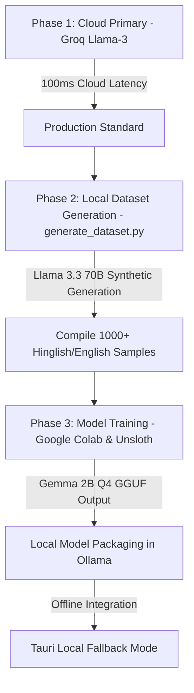

# Fine-Tuning Gemma-2B for Hinglish Dictation Correction: Future Roadmap & Training Guide

Currently, **WisperFlow** is optimized to use **Cloud Mode** (using Groq Whisper for speech-to-text and Groq Llama-3 for post-processing speech corrections). This provides extremely low latency (~100-200ms) and highly accurate context-aware Hinglish mapping.

In the future, we will transition to or add a **Local Offline Layer** using a fine-tuned **Gemma-2B** model. Below is the proper architecture plan and step-by-step implementation guide using the Antigravity CLI and Claude Code tools.

---

## 🗺️ Future Roadmap & Implementation Plan



### 1. Architectural Strategy
* **Cloud Mode (Primary):** The app utilizes `llama-3.1-8b-instant` via the Groq API. Preamble/note leaks are stripped automatically by the Rust coordinator using our custom `strip_llm_decorations` filter.
* **Local Mode (Future):** When the internet is disconnected, or if the user prefers local processing, the app will route prompts to a locally running Ollama model (`hinglish-corrector`) based on the fine-tuned Gemma-2B GGUF.

### 2. Next Steps for Developer Implementation (Antigravity & Claude Code)
When implementing the local layer in the future:
1. Run `python generate_dataset.py` to create the training file.
2. Spin up the Google Colab SFT notebook, upload the generated JSON dataset, and run the training pipeline.
3. Quantize the trained adapter into Q4_K_M GGUF format and load it locally.
4. Set the **Postprocessing Model** in Settings to the imported model name (`hinglish-corrector`).

---

## 🛠️ Step-by-Step Training Guide

### Step 1: Generate the Training Dataset (1,000+ Samples)

To train a robust model, we need a diverse dataset of 1,000+ sentences covering multiple contexts (casual chat, engineering, business, support) and acoustic corruptions. 

Run the Python script `generate_dataset.py` locally in the root folder of the project. It reads your existing Groq API key from your `.env` file and uses **Llama-3.3-70b-versatile** via Groq to synthetically generate 1,000 high-quality training pairs in a loop.

```bash
python generate_dataset.py
```

*(This will output a file named `hinglish_dataset.json` in your project folder).*

---

### Step 2: Training Gemma-2B on Google Colab

Create a new Google Colab notebook, set your **Runtime type to GPU (T4)**, and run the following cells.

#### Cell 1: Install Dependencies (Fast)
```bash
!pip install "unsloth[colab-new] @ git+https://github.com/unslothai/unsloth.git"
!pip install --no-deps xformers trl peft accelerator diffusers
```

#### Cell 2: Load the Model & Configure Training
```python
from unsloth import FastLanguageModel
import torch
from datasets import load_dataset
from trl import SFTTrainer
from transformers import TrainingArguments

max_seq_length = 2048 # Supports RoPE scaling automatically
dtype = None # None for auto-detection. Float16 for Tesla T4 GPU
load_in_4bit = True # Use 4bit quantization to save GPU memory

# Load Base Model (Use "unsloth/meta-llama-3.1-8b-instruct" for Llama 3.1 8B, or "unsloth/gemma-2-2b-it" for Gemma 2B)
model, tokenizer = FastLanguageModel.from_pretrained(
    model_name = "unsloth/meta-llama-3.1-8b-instruct", # Or "unsloth/gemma-2-2b-it"
    max_seq_length = max_seq_length,
    dtype = dtype,
    load_in_4bit = load_in_4bit,
)

# Set up LoRA adapter layers
model = FastLanguageModel.get_peft_model(
    model,
    r = 16, # Choose any number > 0. Suggested 8, 16, 32, 64
    target_modules = ["q_proj", "k_proj", "v_proj", "o_proj",
                      "gate_proj", "up_proj", "down_proj"],
    lora_alpha = 16,
    lora_dropout = 0, # Dropout = 0 is optimized
    bias = "none",    # Bias = "none" is optimized
    use_gradient_checkpointing = "unsloth",
    random_state = 3407,
    use_rslora = False,
    loftq_config = None,
)
```

#### Cell 3: Load Dataset and Train
```python
# Format dataset helper
alpaca_prompt = """Below is an instruction that describes a task, paired with an input that provides further context. Write a response that appropriately completes the request.

### Instruction:
{}

### Input:
{}

### Response:
{}"""

def formatting_prompts_func(examples):
    instructions = examples["instruction"]
    inputs       = examples["input"]
    outputs      = examples["output"]
    texts = []
    for instruction, input_text, output in zip(instructions, inputs, outputs):
        text = alpaca_prompt.format(instruction, input_text, output) + tokenizer.eos_token
        texts.append(text)
    return { "text" : texts }

# Load dataset (upload the 'hinglish_dataset.json' file to your colab folder)
dataset = load_dataset("json", data_files="hinglish_dataset.json", split="train")
dataset = dataset.map(formatting_prompts_func, batched = True)

# Set training arguments
trainer = SFTTrainer(
    model = model,
    tokenizer = tokenizer,
    train_dataset = dataset,
    dataset_text_field = "text",
    max_seq_length = max_seq_length,
    dataset_num_proc = 2,
    packing = False, # Can make training 5x faster for short sequences.
    args = TrainingArguments(
        per_device_train_batch_size = 2,
        gradient_accumulation_steps = 4,
        warmup_steps = 5,
        max_steps = 60,
        learning_rate = 2e-4,
        fp16 = not torch.cuda.is_preferred_dtype(),
        logging_steps = 1,
        optim = "adamw_8bit",
        weight_decay = 0.01,
        lr_scheduler_type = "linear",
        seed = 3407,
        output_dir = "outputs",
    ),
)

# Run the training loop!
trainer_stats = trainer.train()
```

---

### Step 3: Export Model to GGUF format

Run this cell in Colab to convert your fine-tuned model into GGUF quantization (4-bit quant `q4_k_m`) directly. This is optimized for Ollama:

```python
# Save local GGUF quant (use "hinglish_llama_8b" if training Llama)
model.save_pretrained_gguf("hinglish_llama_8b", tokenizer, quantization_method = "q4_k_m")
```
*(This will save a file named `hinglish_llama_8b-unsloth.Q4_K_M.gguf` in your Colab files directory. Download it to your computer).*

---

### Step 4: Import to Ollama

1. Move the downloaded `.gguf` file to your computer's local directory (e.g. `/home/shreyas/models/`).
2. Create a file named `Modelfile` in that directory:
   ```dockerfile
   FROM ./hinglish_llama_8b-unsloth.Q4_K_M.gguf
   PARAMETER temperature 0.0
   SYSTEM Below is an instruction that describes a task, paired with an input that provides further context. Clean up transcription errors, typos, and acoustic mishearings contextually. Preserve Hinglish and English words exactly as spoken. Do NOT translate to English.
   ```
3. Open your terminal and create the model inside Ollama:
   ```bash
   ollama create hinglish-corrector -f Modelfile
   ```
4. In WisperFlow Settings, update the **Postprocessing Model** to: `hinglish-corrector` and click save.
